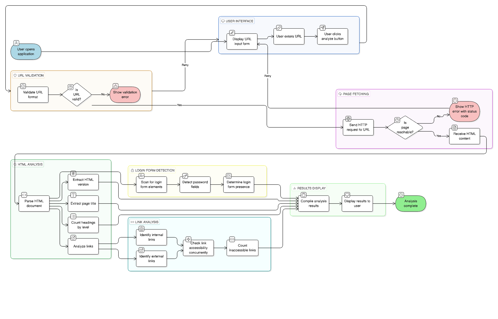
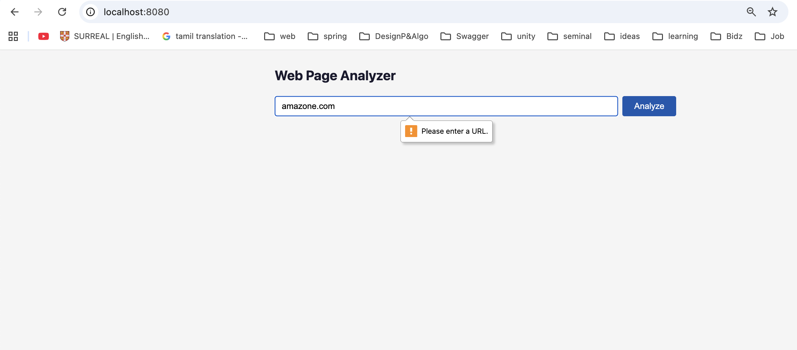
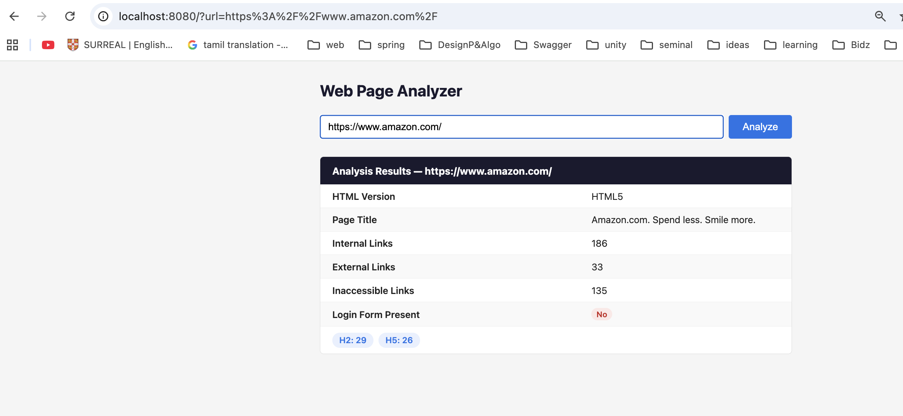
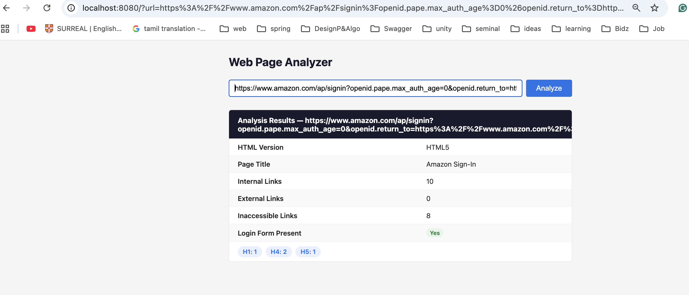
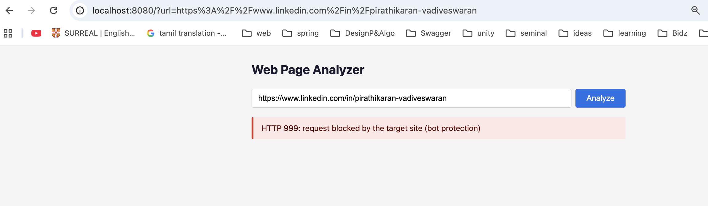
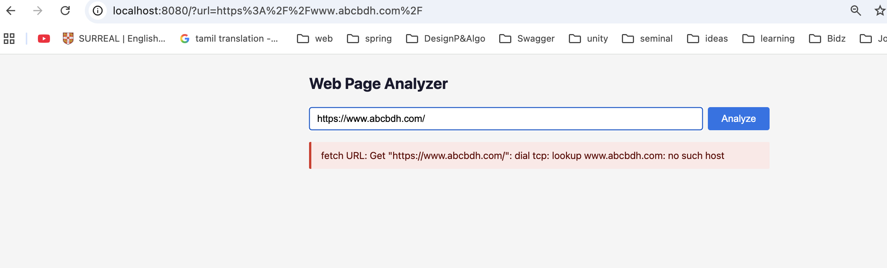

# Web Analyzer

A web page analysis tool built with Go. You give it a URL, it fetches the page and tells you everything useful about it — HTML version, heading structure, internal vs external links, broken links, login form detection, and more.

## System Design



## What It Does

When you submit a URL, the analyzer:

1. Fetches the page using an HTTP client with a 20-second timeout
2. Parses the HTML and extracts:
   - HTML version (HTML5, HTML 4.01, XHTML, etc.)
   - Page title
   - Heading counts (h1 through h6)
   - Internal and external link counts
   - Whether a login form is present
3. Concurrently checks all links (up to 10 at a time) to find broken/inaccessible ones
4. Returns the results rendered in a clean HTML page

---

## Screenshots

### Home Page


### Successful Analysis


### Login Form Detected


### Blocked / Bot-Protected Site


### Unreachable / No Website Error


---

## Project Structure

```
web-analyzer-go/
├── cmd/
│   └── server/
│       └── main.go          # Entry point
├── internal/
│   ├── analyzer/            # Core analysis logic
│   ├── handler/             # HTTP handlers and middleware
│   └── metrics/             # Prometheus metrics
├── web/
│   └── templates/
│       └── index.html       # UI template
├── Dockerfile
├── Makefile
└── go.mod
```

---

## Running Locally

### Prerequisites

- Go 1.23+

### Steps

```bash
# Clone the repo
git clone https://github.com/Pirathikaran/web-analyzer.git
cd web-analyzer-go

# Download dependencies
go mod download

# Run the server
go run ./cmd/server
```

The server starts on **http://localhost:8080**

You can override the port:

```bash
PORT=9090 go run ./cmd/server
```

---

## Running with Docker

No Go installation needed — Docker handles everything.

### Build the image

```bash
docker build -t web-analyzer .
```

### Run the container

```bash
docker run -p 8080:8080 web-analyzer
```

Then open **http://localhost:8080** in your browser.

### Use a different port

```bash
docker run -p 3000:3000 -e PORT=3000 web-analyzer
```

---

## API Endpoints

| Method | Path       | Description                          |
|--------|------------|--------------------------------------|
| GET    | `/`        | Home page with URL input form        |
| POST   | `/analyze` | Submit a URL and get analysis result |
| GET    | `/metrics` | Prometheus metrics endpoint          |

---

## Observability

### Prometheus Metrics

Available at `GET /metrics`:

| Metric                                    | Type      | Description                        |
|-------------------------------------------|-----------|------------------------------------|
| `web_analyzer_requests_total`             | Counter   | Total requests by status           |
| `web_analyzer_request_duration_seconds`   | Histogram | Request latency distribution       |
| `web_analyzer_errors_total`               | Counter   | Total analysis errors              |

### pprof (Debug Profiling)

A pprof debug server runs on `127.0.0.1:6060` (localhost only). Useful for profiling in development:

```bash
go tool pprof http://localhost:6060/debug/pprof/heap
```

---

## Running Tests

```bash
go test ./...
```

---

## Configuration

| Environment Variable | Default | Description      |
|----------------------|---------|------------------|
| `PORT`               | `8080`  | HTTP listen port |

---

## Tech Stack

- **Go 1.23** — standard library HTTP server, structured logging (`slog`)
- **golang.org/x/net/html** — HTML parsing
- **Prometheus** — metrics and monitoring
- **Docker** — containerized deployment (multi-stage build, minimal Alpine image)
